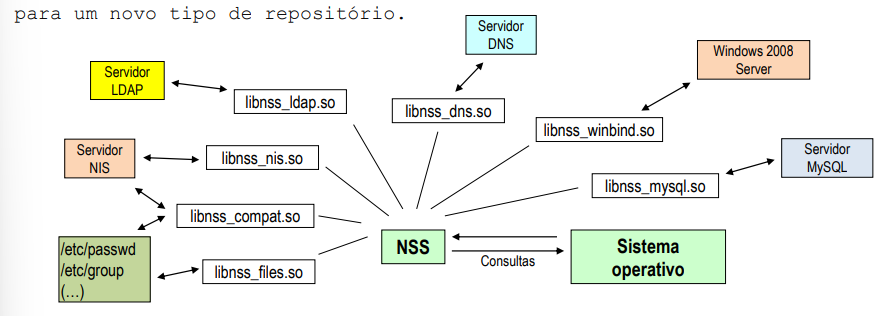
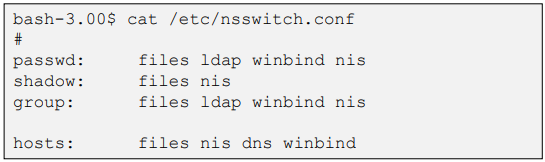
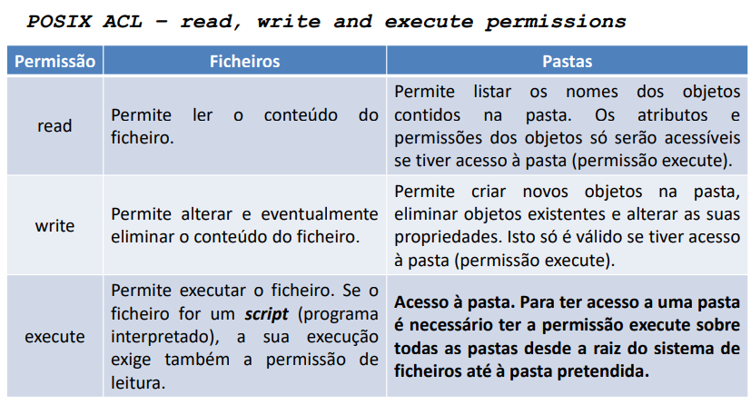
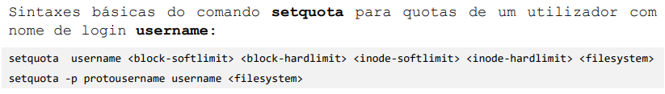

> # TP1
>
>## Termos Gerais e Designações:
>### MBR (Master Boot Record) - é uma área especial no disco rígido que contém informações essenciais para iniciar o sistema operativo do computador, como o código de inicialização e a tabela de partição. Este está localizado no primeiro setor do disco e é fundamental para o processo de inicialização do computador.
>
>### GPT (GUID Partition Table) - é um padrão de tabela de partição para o layout da tabela de partição em um disco rígido físico, usando um identificador de globally unique identifier (GUID). Embora seja parte do padrão Extensible Firmware Interface (EFI), Este também é usado em alguns sistemas BIOS, porque Este resolve algumas limitações do MBR.
>
>### NTFS (New Technology File System) - é um sistema de arquivos proprietário desenvolvido pela Microsoft. Começou a ser usado em 1993 com o Windows NT 3.1, substituindo o FAT. O NTFS possui recursos como suporte a metadados e a recuperação de dados, que não estão presentes no FAT.
>
>### ACL (Access Contol List) - é uma lista de permissões associada a um objeto. Cada entrada na lista especifica um sujeito e um conjunto de operações permitidas para esse sujeito. O sistema de arquivos NTFS usa ACLs para controlar o acesso a arquivos e pastas.
>
> ### Journaling - registo de operações de escrita antes de serem aplicadas, deste modo havendo uma falha grave não é necessário verificar a integridade de todo o disco, apenas a zona que estava a ser escrita.
>
> ### DHCP (Dynamic Host Configuration Protocol) - é um protocolo de serviço  TCP/IPque oferece configuração dinâmica de terminais, com concessão de endereços IP de host, máscara de sub-rede, default gateway (gateway padrão), número IP de um ou mais servidores DNS, sufixos de pesquisa do DNS e número IP de um ou mais servidores WINS.
>
> ## Termos Linux:
>### /dev/sda - é o primeiro disco rígido do sistema, o segundo é /dev/sdb e assim por diante. O número após o sda é a partição do disco rígido. Por exemplo, /dev/sda1 é a primeira partição do primeiro disco rígido.
>
>### fdisk - é um comando de para visualizar e gerir partições no disco rígido. Este permite criar, apagar, redimensionar, mover, copiar e alterar o tipo de partição.
>
>### /etc/fstab - é um arquivo de configuração que contém informações sobre os sistemas de arquivos e dispositivos de armazenamento conectados ao sistema. Este é lido pelo comando mount para determinar quais opções de montagem devem ser usadas ao montar os sistemas de arquivos e onde Estes devem ser montados.

> # TP2
>
> ## Termos Gerais e Designações:
>
> ### Active Directory - é um serviço de diretório que armazena informações sobre objetos numa rede e disponibiliza essas informações a utilizadores e administradores dessa rede. Este é responsável por autenticar e autorizar todos os computadores e utilizadores duma rede de domínio Windows, atribuindo e verificando as credenciais de segurança para todos os utilizadores e computadores. Este permite que os administradores atribuam políticas, instalem programas em muitos computadores e apliquem atualizações críticas a um conjunto inteiro de computadores.
>
> ### LDAP (Lightweight Directory Access Protocol) - é um protocolo de aplicação aberto para acessar e manter serviços de diretório distribuído sobre uma rede IP. Este permite que utilizadores e aplicações localizem dados em um servidor em uma rede TCP/IP sem saber a localização física do servidor.
>
> ### DNS (Domain Name System) - é um sistema de gestão de nomes hierárquico e distribuído para computadores, serviços ou qualquer recurso conectado à Internet ou a uma rede privada. Este associa várias informações com nomes de domínio atribuídos a cada um dos participantes. A maioria das aplicações que usam a Internet, como navegadores web, consultam o DNS para obter o endereço IP de um domínio específico.
>
> ### Active Directory Domain Services (AD DS) - é um serviço de diretório baseado no LDAP que armazena informações sobre objetos numa rede e disponibiliza essas informações a utilizadores e administradores dessa rede. Este é responsável por autenticar e autorizar todos os computadores e utilizadores duma rede de domínio Windows, atribuindo e verificando as credenciais de segurança para todos os utilizadores e computadores. Este permite que os administradores atribuam políticas, instalem programas em muitos computadores e apliquem atualizações críticas a um conjunto inteiro de computadores.
>
> ### Domain Member - é um computador que é adicionado a um domínio e que é gerido pelo Active Directory. Este pode ser um servidor ou um cliente.
>
> ### Domain Controller - é um servidor que responde a solicitações de autenticação e autorização de utilizadores, computadores e serviços dentro de um domínio. Este autentica os utilizadores, armazena informações de segurança relativas a todos os objetos que estão no domínio e define as políticas de segurança para todos os computadores e objetos do domínio.
>
> ### Global Catalogue Server - é um servidor que contém uma cópia parcial de todos os objetos num domínio. Este é usado para pesquisar objetos em todo o domínio sem a necessidade de contactar um controlador de domínio para cada pesquisa. Este também é usado para autenticar utilizadores.
>
> ## Termos Linux:
>
> ### /etc/passwd - é um arquivo de texto que contém informações para a autenticação de utilizadores. Este é usado para armazenar as informações de conta do utilizador que são necessárias ao sistema operativo para a autenticação de utilizadores.
>
> ### /etc/shadow - é um arquivo de texto que contém as senhas criptografadas dos utilizadores. Este é usado para armazenar as senhas criptografadas dos utilizadores que são necessárias ao sistema operativo para a autenticação de utilizadores.
>
> ### /etc/group - é um arquivo de texto que contém informações sobre os grupos do sistema. Este é usado para armazenar as informações de grupo que são necessárias ao sistema operativo para a autenticação de utilizadores.
>
> ### NIS (Network Information Service) - é um serviço de diretório distribuído para a gestão centralizada de configurações de sistemas operativos e aplicações. Este permite que os utilizadores em computadores clientes entrem na sessão e partilhem recursos em qualquer computador do domínio.
>
> ### NSS (Name Service Switch) - é um sistema modular que permite integrar nos sistemas Linux diversos tipos de repositórios de informação de sistema através da adição de um novo módulo (biblioteca dinâmica) acrescenta-se o suporte para um novo tipo de repositório de informação. 
>
> ### /etc/nsswitch.conf - é um arquivo de texto que contém as configurações do NSS. Este é usado para configurar o NSS. 
>
>
> ### PAM (Pluggable Authentication Modules) - é um sistema de autenticação flexível que permite que os administradores configurem diferentes métodos de autenticação sem alterar o código fonte das aplicações. Este trata do processo de autenticação de utilizadores. Quando os utilizadores estão em repositórios remotos o PAM tem de recorrer a eles.
>
> ### PAP (Password Authentication Protocol) - é um protocolo de autenticação que usa senhas para autenticar utilizadores. Este é um protocolo inseguro porque as senhas são enviadas em texto simples.
>
> ### CHAP (Challenge-Handshake Authentication Protocol) - é um protocolo de autenticação que usa senhas para autenticar utilizadores. Este é um protocolo seguro porque as senhas são enviadas em texto cifrado. Este não pode ser implementado através dos hash tradicionais do Unix, mas pode ser implementado com recurso a módulos PAM apropriados.

> # TP3
>
> ## Termos Gerais e Designações:
> 
> ### ACL - é uma lista de permissões associada a um objeto. Cada entrada na lista especifica um sujeito e um conjunto de operações permitidas para esse sujeito. O sistema de arquivos NTFS usa ACLs para controlar o acesso a arquivos e pastas. 
>
> ### ACE (Access Control Entries) - é uma entrada numa ACL que especifica um sujeito e um conjunto de operações permitidas para esse sujeito.
>    
> ### DACL (Discretionary Access Control List) - destina-se a controlar o acesso ao objeto definido a permissões de cada ACE. Cada permissão pode ser dad (Allow) ou retirada (Deny). Para gerir este tipo de ACL basta ter as permissões adequadas sobre o objeto.
>
> ### SACL (System Access Control List) - destina-se a registar os acessos (audit reports). Para cada ACE contém uma lista de permissões que quando são aplicadas ficam registadas em log. Para cada ACE e para cada permissão podem ser registadas as tentativas de acesso bem sucedidas (Success) e/ou falhas (Fail). As SACL só podem ser geridas pelos Administradores do sistema.
>
>
> ## Termos Linux:
>
> ### others - grupo implícito que contém todos os utilizadores que não são o dono do ficheiro nem pertencem ao grupo do ficheiro.
>
> ### ACL POSIX - é um conjunto de regras que define as permissões de acesso a um ficheiro ou diretório. Este é usado para definir as permissões de acesso a um ficheiro ou diretório. 
>
>
> ### setuidz - é uma permissão que permite que um ficheiro seja executado com os privilégios do dono do ficheiro. Este é usado para executar ficheiros com os privilégios do dono do ficheiro.
> 
> ### setgid - é uma permissão que permite que um ficheiro seja executado com os privilégios do grupo do ficheiro. Este é usado para executar ficheiros com os privilégios do grupo do ficheiro.
>
> ### sticky - usado nas pastas temporárias partilhadas nas quais todos os utilizadores podem criar objetos. Faz com que a permissão write sobre a pasta deixe de ser condição suficiente para remover, renomear ou alterar propriedades de objetos armazenados na pasta, apenas o proprietário do próprio objeto poderá realizar essas opções
>
> ### chmod - é um comando que permite alterar as permissões de acesso a um ficheiro ou diretório.
>
> ### UMASK - é uma máscara de negação de permissões em representação octal anteriormente descrita, o seu significado é que os bits existentes na UMASK devem ser retirados das permissões dos objetos criados.
>
> ### quotacheck - é um comando que permite verificar o espaço em disco usado por cada utilizador. É frequentemente usado para iniciar ou atualizar a base de dados de cotas.
>
> ### quotaon | quotaoff - é um comando que permite ativar ou desativar o sistema de cotas.
>
> ### edquota - é um comando que permite editar as cotas de um utilizador ou grupo.
>
> ### repquota - é um comando que permite apresentar um relatório das cotas de utilizadores ou grupo.
>